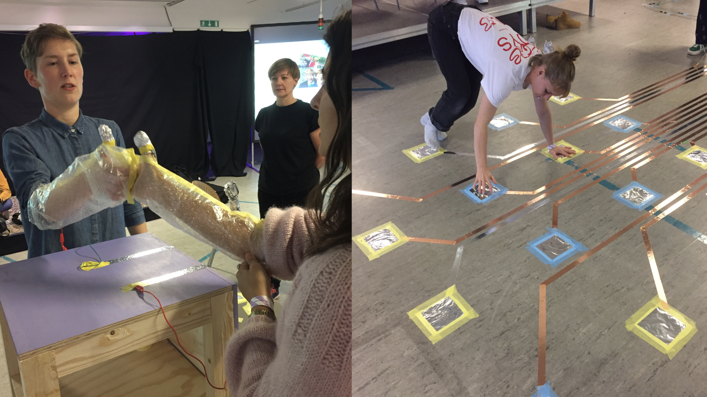
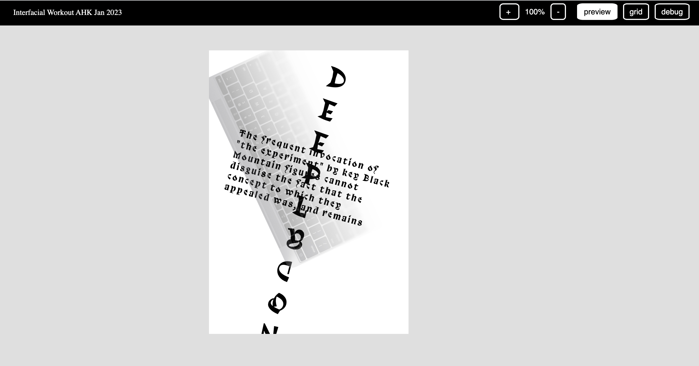
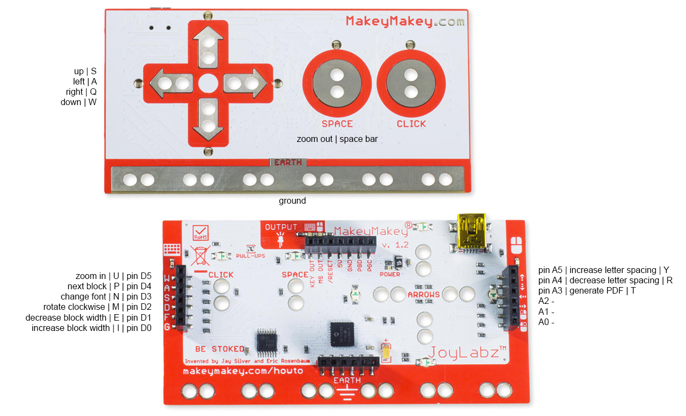
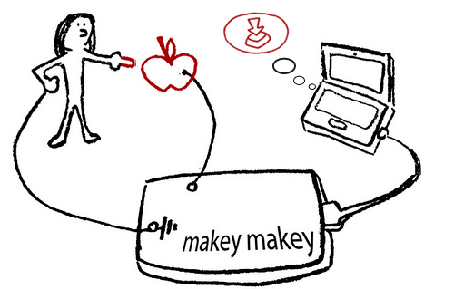

# interfacial-workout

The Graphic User Interface (GUI) is the designer's daily companion – friendly and convenient, it translates binary calculations into seemless and intuitive interactions. As skilled designers we embody our interfaces. While intuitively scrolling, clicking, dragging, dropping we provoke the computer to deploy, react, and return. In this intensive work-out session we will investigate the notion of embodiment in relation to designer-computer intra-action*.

Together we explored bodily ways to break with our own design habits by imagining what it could mean to physically engage with our design tools and a design process. Forget about your keyboards and trackpads. Together we will be designing bodily interfaces, that let us design a publication with gestures! 

Here's a short summary of the workshop flow: [https://chatty-pub.hackersanddesigners.nl/Scriptothek#ch-interfacialworkout](https://chatty-pub.hackersanddesigners.nl/Scriptothek#ch-interfacialworkout)






## Acknowledgements

This workshop is based on a project by Sarah Garcin called the PJ machine. After following a workshop with her in 2017, H&D got very inspired to many more things with this software. Sarah developed a new version of the software for Hackers & Designers, which we will be using in this workshop. You can find Sarah's original repository here: 

[https://github.com/sarahgarcin/pj-machine-workshop](https://github.com/sarahgarcin/pj-machine-workshop)

And here's and interview we did with her in 2022: 

[http://firstthenrepeat.hackersanddesigners.nl/#Interfacial-Workout](http://firstthenrepeat.hackersanddesigners.nl/#Interfacial-Workout)


## Installing the software 

Download the repository **interfacial-workout-23**

> [https://github.com/hackersanddesigners/interfacial-workout-23](https://github.com/hackersanddesigners/interfacial-workout-23)

### Dependencies

You need to install *Node* first, available here: [node.js](https://nodejs.org/)

You need to have Chrome browser installed: [https://chromeenterprise.google](https://chromeenterprise.google)

You might have to install some additional things, like xcode developer tools, but you will be prompted for that if necessary when running npm install later.

### Install process

Open a terminal window to execute commands and install the programm.

- macOS: go to Applications -> Utilities -> Terminal
- Linux: use a terminal app such as Terminal or Konsole
- Windows 10 & 11: command promt (PowerShell or Windows Terminal): 
	- open Command Prompt by typing "command prompt" or "cmd" in the start menu. It will open a new window
	- for windows command "dir" replaces what ls (list) does in Shell. A little guide [here](https://www.makeuseof.com/tag/a-beginners-guide-to-the-windows-command-line/) and [here](

In your terminal, navigate to the pj-machine folder with your terminal using the `cd` command (cd stands for *change directory)*:

```
cd [path/to/your/folder]
```
If you don't know how to find the path to the folder you can also type **cd** and then drag and drop the "interfacial-workout-23" folder into the terminal window, then hit ENTER.

If you type a list command (ls) and then ENTER, you should see the same files listed that exist in the folder, (e.g. *bin, config.js, content, gulpfile.js* etcetera. 

```
ls
```
*On windows: if ls doesnt work, try "dir" instead*

Now you need to install other things we need (dependencies) by typing the following command and hitting ENTER. This process may take up to 5 minutes:

```
npm install
```  
 
You might get some errors, if it says something about installing xcode, install that. Most other errors can be ignored and you can try running the PJ machine. 

 
## Run PJ Machine

### Starting the server

Start the node server folder with the following command. In terminal, type: 


*If necessary* (if you closed the terminal window for example):

```
cd [path to folder]
```
Then start the server from there

```
node server.js
```

Now open a window in Chrome browser and go to [http://localhost:1337](http://localhost:1337)

### Stopping the server

To stop the server: type **ctrl + c** in terminal

## Preparing files

Follow the files structure and expand. The logic is: 

01, 02, 03 and so on are pages, within each page you can prepare folders with content (e.g. 1, 2, 3, 4, and so on). Each block folder can contain one piece of text OR one image. Check that the path in the data.txt file is correct and the link to the image follows the folder structure path or they won't show up. 

Index number in the data.txt file should point to the block number (e.g. page 01, block 3 has index: 3). 

### Adding more content

You can make more content blocks by creating a new folder (keep the numbering structure in tact), and then copying the data.txt file from one of the previous blocks in that same folder. Then change the paths accordingly. 

NOTE: copy-pasting whole folders often leads to errorrrrrrs. 

## Using the PJ machine

The PJ Machine has some functions include by default you can use. All functions can be fired by a keypress. The ones marked **bold** will be used for the interfacial workout today.

* O > Go to previous content
* **P > Go to next content > pin D4** 
* **A > Move Left > arrow**
* **Q > Move Right > arrow**
* **W > Move Down > arrow**
* **S > Move Up > arrow**
* **U > Zoom In > pin D5**
* **Space > Zoom Out > space**
* **I > Increase block width > pin D0**
* **E > Decrease block width > pin D1**
* **Y > Increase letter spacing > pin A5**
* **R > Decrease letter spacing > pin A4**
* **N > Change font > pin D3**
* B > Change color (random) > n/a
* **M > Rotate Clockwise > pin D2**
* L > Rotate Counterclockwise > n/a
* **T > Generate PDF > pin A3**


## Remap Makey Makey to match PJ machine hotkeys

**Remapping using the Arduino environment**

To make full use of the functions available in the PJ machine, you need to remap the pins of the Makey Makey. In this repository you can find a folder called *makey-makey* that has an .ino file and an .h file inside. 

Follow this tutorial to reprogram the makey makey to use the right keys: 
[https://learn.sparkfun.com/tutorials/makey-makey-advanced-guide](https://learn.sparkfun.com/tutorials/makey-makey-advanced-guide)

*NOTE: Instead of using the code provided in the tutorial you have to use the .ino and related .h files provided in this repository.*

The code maps the makey makey pins as follows: 



We will play with these 9 design properties during this workshop: 

* group 1: move left & right | **a** and **q** | makey left and right arrow
* group 2: move up & down | **s** and **w** | makey up and down arrow
* group 3: zoom out & zoom in | **space** and **u** | makey space pin and pin D5
* group 4: select next block | **p** | makey pin D4
* group 5: select next font | **n** | makey pin D3
* group 6: rotate | **m** | makey pin D2
* group 7: decrease block width | **e** | makey pin D1
* group 8: increase block width | **i** | makey pin D0
* group 9: increase letter spacing | **y** | makey pin A5
* group 10: decrease letter spacing | **r** | makey pin A4

**To generate a PDF of the page for print, press the letter T on your computer keyboard**

## Bonus: use an Arduino Leonardo as Makey Makey

[https://www.instructables.com/id/DIY-Makey-Makey-With-Arduino-Leonardo/](https://www.instructables.com/id/DIY-Makey-Makey-With-Arduino-Leonardo/)

## Making your own buttons

Anything conductive can be used to create on/off switches to activate the key presses mentioned above. Think: aluminum foil, metal objects, water, fruit & veg, human bodies. Remember that a "closed" circuit is a working circuit: electricity can flow. An "open" or interrupted circuit doesn't work becauce electricity cannot flow. 

For reference this image from the makey makey: the apple is connected to a pin on the makey. A person is connected to the "ground" or minus pin. The circuit is open (off) until the person touches the apple. Touching the apple closes the circuit, and activates the switch. 




## Trouble shooting

Having issues? Consult the tutorial here to trouble shoot: [https://github.com/sarahgarcin/pj-machine-workshop](https://github.com/sarahgarcin/pj-machine-workshop)

### Content not showing when I run the server

1. Check the terminal window: it gives you hints as to where things are going wrong. 
2. Make sure each block has a data.txt file containing the path and the content. Double check if the path is correct (mistakes in folder names are easy to make. Also check the file path of the image if using images. 
3. Check if the index number listed in the data.txt file is correct (if any). > Page 01 > Block 3 > should have index: 3
3. Sometimes the software adds big blocks of whitelines to the data.txt folders. This makes it seem as though there's nothing more, but actually there are parameters all the way down, like index numbers. This can wreak havoc and make you content disappear.  
4. Sometimes the opactiy of a block is set to 1, for 1% which makes it seem like it's not there. Check the data.txt file for that block and set opacity to 100 (might be allllll the way at the bottom of the file. 


### Parameters for text blocks


path: content/data/00/1

----

content: example text

----

index: 1

----

zoom: 1.5

----

xPos: 2.3999999999999986

----

yPos: 3.9999999999999996

----

wordSpace: 0

----

blockSize: 3.5

----

filesNb: 1

----

font: gulax

----

color: #F5351E

----

rotation: 15

----

strokeWidth: 0

----

opacity: 100

----

## Project bugs and wishlist

* the pdfs seem to take a different crop compared to what is designed, need to look into this
* design not-makey board to DIY! see also [this project](https://www.youtube.com/watch?v=QCxbU6q3SYM&t=237s) and [this project](https://www.instructables.com/DIY-Makey-Makey-With-Arduino-Leonardo/) 
* debug the code so the newlines don't get saved in the data.txt files
* add sound effects > musical design interface :) 
* check the install process for windows 10 and windows 11
* include steps for install of xcode 