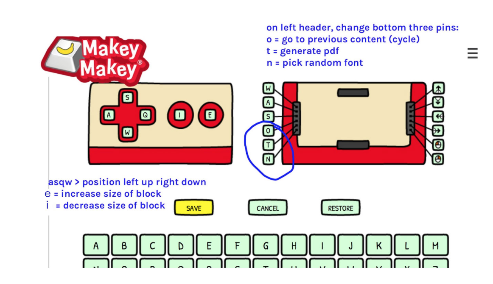

# interfacial-workout

## 1. Install the right version of the PJ machine

**Which controller will you be using?**

Option 1: Leonardo or latest generation of Makey Makey: you are working with an Arduino Leonardo, or a newer version of Makey Makey. Download and unpack this .zip from github:

**pj-machine-hackers1designers-master_ORIGINAL**
*https://github.com/hackersanddesigners/interfacial-workout*

Option 2: Older version of Makey Makey that cannot be remapped using the web interface. So you will use a modified version of the PJ machine. Download the one in this folder: 
> pj-machine-hackers1designers-master-POSTDESIGN

Then, the same for all: 

Follow the instructions here to install all dependencies: 
*https://github.com/sarahgarcin/pj-machine-workshop*

Start the server in terminal:

`cd > path to folder`
`node server.js`

Open the PJ machine interface in e.g. Chrome, at address: 
*http://localhost:1337/*

## 2.1. New Makey Makey: remap keys to match PJ Machine ##

**Remapping using the Arduino environment**

It didn’t work for me doing this in the Arduino IDE. But here’s a tutorial: *https://learn.sparkfun.com/tutorials/makey-makey-advanced-guide)*. 
I had problems with ports. This could should work though if you don’t have issues with ports. Code is in github in folder Arduino code keymapping.

**Remapping with Makey Makey web interface (only for v. 1.2 or higher!)**
The Makey Makey web interface did allow me to remap. A bit more tedious but it works. 
*https://makeymakey.com/pages/remap*

We will use 9 features during this workshop: 

Scale up/down (Space and Click on Makey)
* increase block width > i
* decrease block width > e

Position (Arrows on Makey)
* move left > a
* move right > q
* move up > s
* move down > w

Cycle through elements (pin D on Makey)
* go to previous content > o

Print (pin F on makey)
* generate pdf > t

Choose random font (pin G on Makey)
* random > n

## 2.2. Programming 2 Leonardo Arduino’s as Makey Makeys ##

Use this tutorial *https://www.instructables.com/id/DIY-Makey-Makey-With-Arduino-Leonardo/*. But instead, work with 10Mohm resistors. The 1Mohm used in the tutorial is enough for a direct connection (wire-to-wire, or between any conductors), but adding resistance such as touch contact will not work with 1Mohm. You need to use a higher value for the voltage divider to measure the voltage drop when trying to sense touch. 

Follow the same mapping as the one used above. We already did that, you can use the code in the github in the folder named: Arduino code Leonardo-as-Makey. Note: it contains two sketches, one for each Leonardo. On the first you will use all 6 analog pins, and on the other only 2 (or 3 if you also want to make a choose font button). 

**Need:**
* 2x Leonardo if you want to use all the 8 keybuttons we need for this workshop
* Jumpers & Crocodiles
* 8x 10M ohm resistor, or 32x 2.2M ohm resistors (4x 2.2Mohm in series = 8.8Mohm)
* 2x USB cables to computer
* Arduino IDE

Keys for older generation Makey Makey (factory settings), used with POSTDESIGN version of the PJ Machine

Connect to back header of the Makey Makey, and space button. For this you don’t have to remap the Makey Makey keys, because we changed the PJ machine to match its factory settings. 

**Run PJ machine from the pj-machine-hackers1designers-master-POSTDESIGN folder**

I changed the code of the PJ machine: modified the keys associated with the actions we need for this workshop as far as the makey factory settings of a Makey Makey permit. Because it takes only ASCII I could program 7 buttons only (see below). To print, press T on the computer keyboard.

* W = w = 119 = move up
* A = a = 97 = move down
* S = s = 115 = move left
* D = d = 100 = move right
* F = f = 102 = switch to next object
* G = g = 103 = zoomin key (make bigger)
* Space bar = 32 = zoomout key (make smalller)

* T = print/pdf (on computer keyboard, not on makey)
* N = cycle through fonts (on computer keyboard, not on makey)`

Having issues? Consult the tutorial here to trouble shoot: *https://github.com/sarahgarcin/pj-machine-workshop* 
